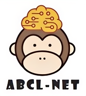

	

<strong>ABCL-Net</strong>: 

<b><u>A</u></b>ttention-<b><u>b</u></b>ased <b><u>C</u></b>ollaborative <b><u>L</u></b>earning Network for Joint Modality Generation and Tissue Segmentation of Early-developing Macaque Brain MR Images.

 

 
 

# Introduction
The ABCL-Net, designed for multi-task cooperation and cross-modality feature interchange, excels at performing both missing modality generation and tissue segmentation simultaneously. By inputting one T1w (T2w) image, users can obtain one generated T2w (T1w) image and one predicted label for macaque brain tissue segmentation.

# System requirement
Since this is a *Linux* based container, please install the container on a Linux system. The supported systems include but not limited to `Ubuntu`, `Debian` and `CentOS`. 

The pipeline is developed based on deep convolutional neural network techniques by Pytorch. A GPU (≥10GB) is required to support the processing. 

# Prepare training patches 
Stored two modality MRI and tissue labels in `MRI_data` folder as following structure:

	MRI_data/
	    ├── T1w
	    │   ├── Case_001_T1w.nii.gz
	    │   ├── Case_002_T1w.nii.gz
	    │   ├── Case_003_T1w.nii.gz
	    │   ├── Case_004_T1w.nii.gz
	    │   ├── ...
	    ├── T2w
	    │   ├── Case_001_T2w.nii.gz
	    │   ├── Case_002_T2w.nii.gz
	    │   ├── Case_003_T2w.nii.gz
	    │   ├── Case_004_T2w.nii.gz
	    │   ├── ...
	    └── Tissue
	        ├── Case_001_Seg.nii.gz
	        ├── Case_002_Seg.nii.gz
	        ├── Case_003_Seg.nii.gz
	        ├── Case_004_Seg.nii.gz
	        ├── ...

Then run the `crop_and_patches.py` to generate training patchees, which will be stored in `patch_data` as follows:

	patch_data/
	    ├── T1
	    │   ├── Case_001_T1w_001.nii.gz
	    │   ├── Case_001_T1w_002.nii.gz
	    │   ├── ...
	    ├── T2
	    │   ├── Case_001_T2w_001.nii.gz
	    │   ├── Case_001_T2w_002.nii.gz
	    │   ├── ...
	    ├── Seg
	    │   ├── Case_001_Seg_001.nii.gz
	    │   ├── Case_001_Seg_002.nii.gz
	    │   ├── ...
	    └── Zero
	        ├── Case_001_T1w_010.nii.gz   
	        ├── Case_001_T2w_010.nii.gz   
	        ├── Case_001_Seg_010.nii.gz  
	        ├── ...
# Training:

`python train.py --name YourProjName --checkpoints_dir  YourModelPath  --dataroot  YourDatasetPath`

# Inference:

`python test.py --name YourProjName --checkpoints_dir YourModelPath --dataroot YourDatasetPath --whichmodel YourModelName`

# Contacts
For questions/bugs/feedback, please contact:

Xueyang Wu, xueyangwow@gmail.com\
Tao Zhong, taozh2315@gmail.com\
School of Biomedical Engineering\
Southern Medical University, China

